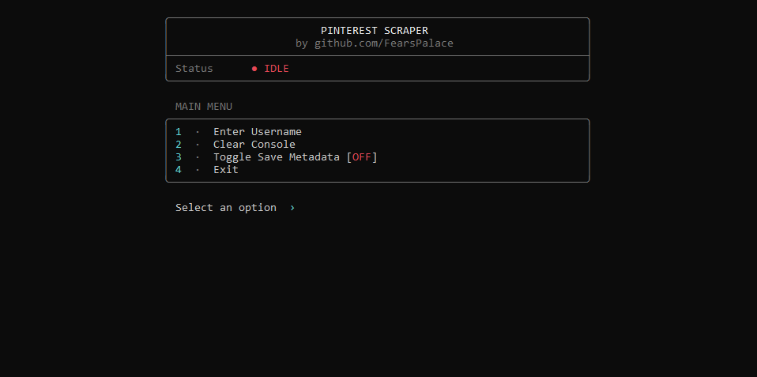

# Pinterest Scraper

A terminal-based Pinterest scraper built with Node.js. It allows you to fetch a user's profile, list their saved boards, and download images directly to your local machine.



## Features
- Interactive terminal UI
- Dynamic profile and board fetching
- Multi-selection for bulk scraping
- Organizes downloaded images into `Username/BoardName` folders
- Built using native Node.js modules (no dependencies required)

## Requirements
- Node.js

## Usage
Start the interactive menu:
```bash
node index.js
```

Or pass a username directly to skip the main menu:
```bash
node index.js Username
```

## How It Works
1. Enter the Pinterest username you want to target.
2. The script will display the user's `_created` pins and their saved boards.
3. Type a board's number to toggle it for scraping.
4. Press `C` to confirm your selection and begin scraping.
5. Images will be saved automatically in the current directory.
