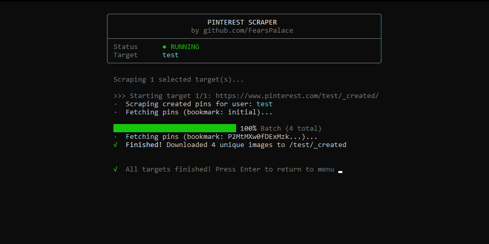

# Pinterest Scraper

A terminal based Pinterest scraper built with Node.js. It allows you to fetch a user's profile, list their saved boards, and download images directly to your local machine.


## Features
- Interactive terminal UI with a live progress bar
- Dynamic profile and board fetching
- Multi-selection for bulk scraping
- Fast parallel downloading
- Option to save pin metadata (titles, descriptions, links) to a JSON file
- Organizes downloaded images into `Username/BoardName` folders
- Built using native Node.js modules (no dependencies required)

## Requirements
- Node.js

## Usage
Start the interactive menu:
```bash
node index.js
```

Or pass a username directly to skip the main menu:
```bash
node index.js Username
```

## How It Works
1. Run the script and optionally toggle the setting to save pin metadata from the main menu.
2. Enter the Pinterest username you want to target.
3. The script will display the user's `_created` pins and their saved boards.
4. Type a board's number to toggle it for scraping.
5. Press `C` to confirm your selection and begin scraping.
6. Images (and metadata) will be saved automatically in the current directory.


